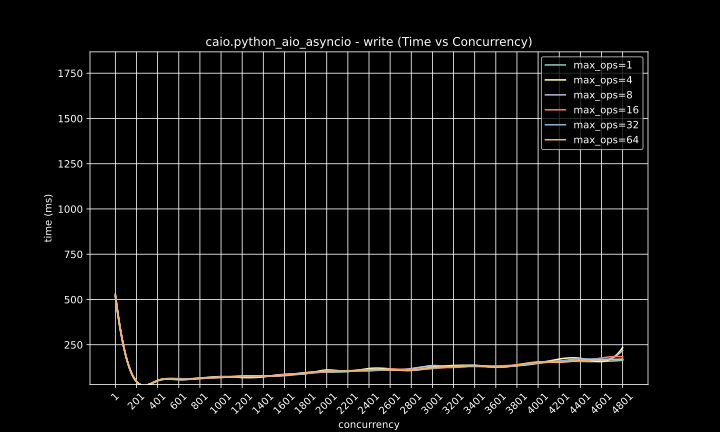

# Benchmarking

## Testing Methodology

### Overview

This benchmark script is designed to evaluate the performance of different AsyncIO contexts in Python. It focuses on 
measuring the efficiency of concurrent I/O operations, specifically file read and write operations, under various 
conditions. The script benchmarks different context classes provided by the `caio` package:
* `PythonAsyncioContext`
* `LinuxAsyncioContext`
* `ThreadAsyncioContext`

The inclusion of each context class is conditional, depending on the system's compatibility and availability of the 
necessary modules.

### Benchmark Parameters

The script configures the benchmarking process with the following parameters:

- **File Size**: The size of the file used for read and write operations is set to 256 MB.
- **Concurrency Levels**: A range of concurrency levels are tested, from `1` to `4999`, increasing in steps of `200`. 
  This parameter determines the number of concurrent read/write operations.
- **Chunk Sizes**: Different chunk sizes are used for read/write operations, calculated as fractions of the total 
  file size, tailored to different concurrency levels.
- **Max Operations**: The maximum number of simultaneous operations allowed in the context. Tested values include `1`, 
  `4`, `8`, `16`, `32`, and `64`.

### Benchmark Process

The script performs the following steps for each combination of parameters and each context class:

1. **Setup**: A temporary directory and file (`test.bin`) are created for the benchmarking process.
2. **Write Benchmarking**:
   - A predefined chunk of data is written to `test.bin` concurrently, according to the concurrency level.
   - The operation is timed, and exceptions, if any, are logged.
3. **Read Benchmarking**:
   - Data is read from `test.bin` in chunks, concurrently based on the concurrency level.
   - The read operation is timed, and exceptions are recorded.

### Data Recording

For each test case, the following data is recorded:

- Implementation (context class)
- Type of operation (read/write)
- Time taken for the operation
- Chunk size
- Level of concurrency
- Maximum number of operations
- Success status
- Any exceptions encountered

### Output

The results are output as CSV format, making it easy to analyze and compare the performance of different AsyncIO contexts under various conditions.

## What This Benchmark Shows

This benchmark script is a comprehensive tool for analyzing the performance of different AsyncIO contexts in handling file I/O operations in Python. By varying parameters like concurrency level, chunk size, and the maximum number of operations, it provides insights into:

- **Efficiency**: How efficiently each context handles concurrent I/O operations.
- **Scalability**: How performance changes with increasing levels of concurrency.
- **Context Suitability**: Which context is best suited for specific types of I/O operations, considering factors 
  like system environment and operational requirements.

The script is particularly useful for developers and system administrators looking to optimize Python applications
that heavily rely on file I/O operations, providing them with data to make informed decisions about the most
appropriate AsyncIO context to use.

## Running benchmark

```shell
cd benchmark
pip install -r requirements.txt

# Run benchmark
python benchmark.py --directory /tmp > results.csv

# Render graphs
python graph.py results.csv
```

## Results

### Testing Environment `MacBook M1` / `Linux VM` / `tmpfs`

The benchmarking was conducted on a MacBook with an M1 CPU. In an ARM Linux Virtual Machine.

### Configuration Specifics

For the benchmark tests, a critical configuration was implemented: the `/tmp` directory was mounted as `tmpfs`. This 
decision was made to specifically measure the overhead of the AsyncIO contexts. `tmpfs` is a temporary file system 
that resides in memory, significantly reducing the latency usually associated with disk-based storage. By using 
`tmpfs`, the benchmark aims to isolate the performance impact attributable solely to the AsyncIO contexts, rather 
than to disk I/O performance.

#### Execution Time Distribution


#### Read time vs Chunk size


#### Read time vs concurrency


#### Write time vs Chunk size


#### Write time vs Concurrency


### Testing Environment `MacBook M1` / `Linux VM` / `btrfs`

The benchmarking was conducted on a MacBook with an M1 CPU. In an ARM Linux Virtual Machine.

### Configuration Specifics

For the benchmark tests, a no special configurations just run tests under `btrfs`. 

#### Execution Time Distribution


#### Read time vs Chunk size


#### Read time vs concurrency


#### Write time vs Chunk size


#### Write time vs Concurrency





### Testing Environment `Linux on Xeon E3-1265L` / `tmpfs`

The benchmarking was conducted on a Linux server with a Xeon E3-1265L CPU.

### Configuration Specifics

For the benchmark tests, a critical configuration was implemented: the `/tmp` directory was mounted as `tmpfs`. This 
decision was made to specifically measure the overhead of the AsyncIO contexts. `tmpfs` is a temporary file system 
that resides in memory, significantly reducing the latency usually associated with disk-based storage. By using 
`tmpfs`, the benchmark aims to isolate the performance impact attributable solely to the AsyncIO contexts, rather 
than to disk I/O performance.

#### Execution Time Distribution


#### Read time vs Chunk size


#### Read time vs concurrency


#### Write time vs Chunk size


#### Write time vs Concurrency


### Testing Environment `Linux on Xeon E3-1265L` / `zfs` (`4 HDD` + `l2arc on ssd`)

The benchmarking was conducted on a Linux server with a Xeon E3-1265L CPU. With 4 HDD disk array and enabled 
zfs `l2arc` on SSD. 

### Configuration Specifics

For the benchmark tests, a no special configurations just run tests under `zfs` volume.

#### Execution Time Distribution


#### Read time vs Chunk size


#### Read time vs concurrency


#### Write time vs Chunk size


#### Write time vs Concurrency


